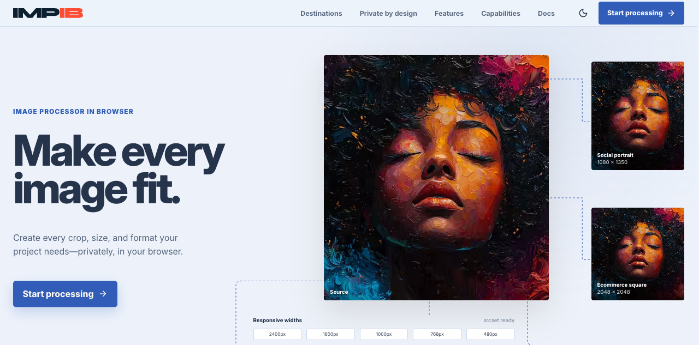

  <picture>
    <source media="(prefers-color-scheme: dark)" srcset="assets/impib-logo-light.svg" />
    
  </picture>

**Private, browser-based image production and responsive asset compiler.**

Turn one source image (or an entire batch) into optimized, consistently framed, production-ready assets without uploading confidential files.

> This is IMPIB's public support and release-notes repository. The application source code and internal development repository are private.

**[Open IMPIB](https://www.impib.dev)** · **Current version:** 1.0.0 · [Release notes](CHANGELOG.md) · [Get help or report an issue](https://github.com/StanSkrivanek/IMPIB/issues/new/choose)

When reporting a problem, include your browser, device, source image dimensions, selected formats, and steps to reproduce it. Please do not attach confidential source images or metadata; use a safe sample when possible.

## Overview

IMPIB (Image Processor In Browser) is more than a conventional image compressor. It is a complete in-browser production workflow for creating optimized images, responsive variants, exact-size crops, and organized delivery packages from a single source.

All decoding, transformation, analysis, and encoding happens locally in Web Workers using WebAssembly codecs. There is no image upload endpoint, backend processing, telemetry, or advertising.

## Highlights

- **Standard and Advanced workflows** — move from a guided image-set builder to detailed professional controls without losing your settings.
- **Single-image and batch production** — optimize one image or process a device-aware queue in parallel.
- **Modern image formats** — read JPEG, PNG, WebP, and AVIF; export AVIF, WebP, JPEG, PNG, and JPEG XL.
- **Responsive asset sets** — create multiple formats and widths from one source with adaptive quality.
- **Production framing** — use exact-size cover crops, aspect-ratio locks, manual crops, and custom focal points for consistent subject placement.
- **Ready-made catalogues** — target common ecommerce, social, advertising, web, print, mobile, desktop, and video dimensions.
- **Reusable recipes and templates** — save codec settings, sizing rules, output names, custom categories, and custom dimensions.
- **Structured exports** — generate first, then download organized ZIP packages with assets, metadata, `manifest.json`, and ready-to-use `<picture>`/`srcset` markup.
- **Private delivery choices** — use normal Browser Downloads everywhere or grant supported browsers access to one selected local folder only when needed.
- **Target-size encoding** — search for the best quality that fits a chosen file-size budget.
- **Image intelligence** — inspect metadata and histograms, classify image content, and apply format and quality recommendations.
- **Professional codec controls** — tune codec-specific options, resize algorithms, metadata handling, and image adjustments.
- **Resilient processing** — memory-aware batching, concurrent workers, cancellation, retry, and automatic recovery from worker failures.

## Formats

| Capability          | Formats                        |
| ------------------- | ------------------------------ |
| Input               | JPEG, PNG, WebP, AVIF          |
| Main output         | AVIF, WebP, JPEG, PNG, JPEG XL |
| Responsive variants | AVIF, WebP, JPEG, PNG, JPEG XL |

Encoding is provided by the [`@jsquash`](https://github.com/jamsinclair/jSquash) WebAssembly codecs.

## Production workflow

1. Add one image or a batch.
2. Choose a guided preset or configure formats, quality, dimensions, crops, and focal points.
3. Compare results, inspect image data, and refine codec settings when needed.
4. Generate individual files or prepare responsive image sets without triggering an automatic download.
5. Review the completed output, then download files directly or save a structured ZIP for handoff.

Standard mode is designed for quickly creating complete responsive sets. Advanced mode adds visual comparison, crop and focal-point tools, analysis, manual resize rules, target-size encoding, and detailed codec controls. Batch mode applies a consistent production recipe across many images while keeping per-image preview and framing tools available. Batch processing and downloading are deliberately separate actions so the browser never downloads a package merely because encoding finished.

## Privacy by design

- Images remain on the user's device.
- Processing runs inside browser Web Workers.
- Array buffers are transferred between threads without a server round trip.
- The application has no upload API, analytics, tracking, or ads.
- Generated object URLs and temporary worker resources are released when no longer needed.
- Local-folder access is optional, browser-controlled, and requested only when the user selects a folder or saves an export. Unsupported or denied access falls back to Browser Downloads.

> Browser extensions, the operating system, and the hosting provider remain outside the application's control. Review your deployment environment if you use IMPIB for sensitive material.

## Issues and release notes

Use the guided [issue forms](https://github.com/StanSkrivanek/IMPIB/issues/new/choose) to report a bug or suggest an improvement. Read the [support guide](SUPPORT.md) before posting and follow the [security policy](SECURITY.md) for potential vulnerabilities. Published changes are listed in the [public changelog](CHANGELOG.md).
